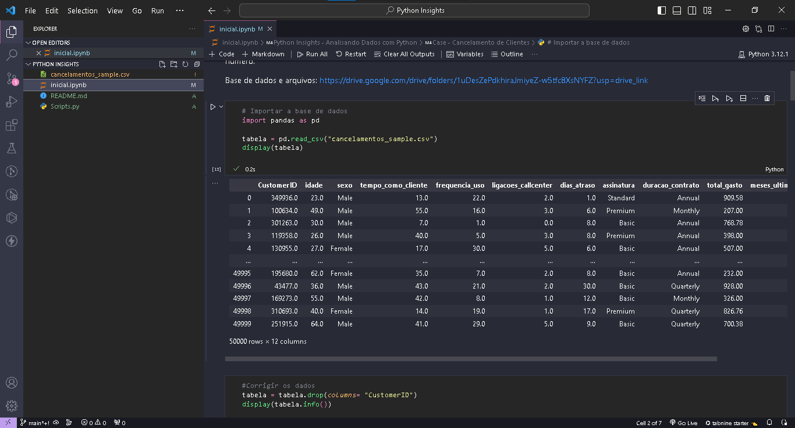
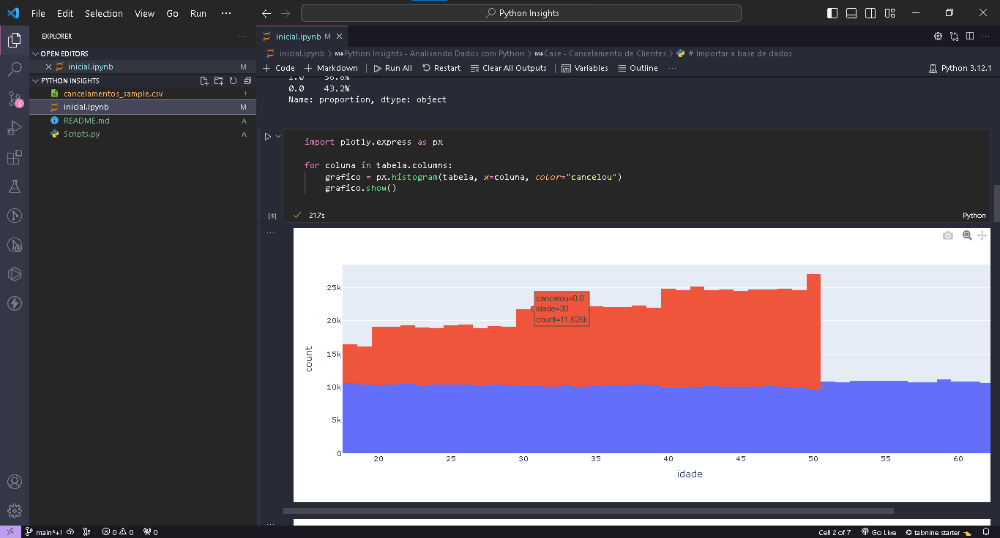
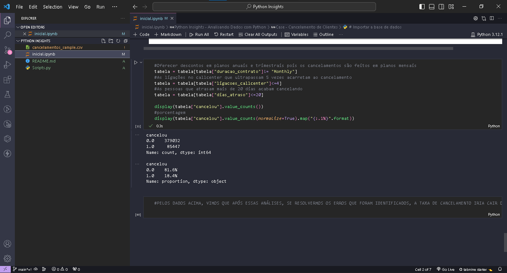

# Projeto: Python Insights - Análise de Cancelamento de Clientes

## Descrição do Projeto

Este projeto de análise de dados foi desenvolvido para uma empresa com mais de 800 mil clientes que enfrenta desafios relacionados ao cancelamento de serviços. O objetivo é identificar os principais motivos de cancelamento e propor ações eficientes para reduzir essa taxa.

## Estrutura do Projeto

- `cancelamentos_sample.csv`: Arquivo contendo os dados de cancelamento.
- `.github`: Diretório com imagens para documentação.

## Como Executar

1. Instale as dependências necessárias com `pip install -r requirements.txt`.

## Análise de Dados

### Correção de Dados
- Remoção da coluna "CustomerID".
- Tratamento de valores vazios.

### Análise Exploratória
- Visualização de cancelamentos por diferentes variáveis.

### Estratégias para Redução de Cancelamentos
- Exclusão de planos mensais.
- Limitação de ligações no call center.
- Controle de atrasos de pagamento.

### Resultados
Após as análises e correções, a taxa de cancelamento foi reduzida de 56% para 18%.

## Resultados e Demonstração

<table>
    <tbody>
        <tr>
            <td>
                
            </td>
            <td>
                
            </td>
            <td>
                
            </td>
        </tr>
    </tbody>
</table>

## Publicação no LinkedIn

[Veja minha publicação sobre o desafio no LinkedIn](https://www.linkedin.com/posts/alex-cavalcanti-198979216_dataanalysis-python-projects-activity-7150848775454875649-SXDD?utm_source=share&utm_medium=member_desktop)
